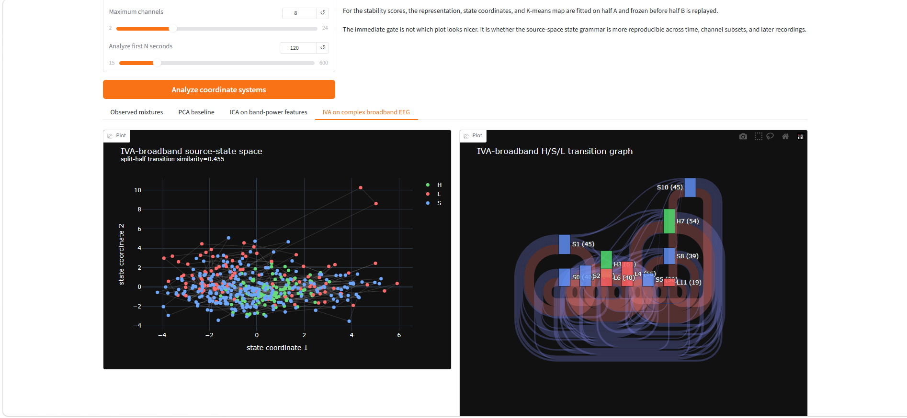

# BrainArchitectureAnalyzer2



GPT-5.6 Sol rebuild of the old `BrainArchitectureAnalyzer` after the Monday / ICA / IVA / FunctionalArbors work.

The old analyzer had a good visual instinct and an overconfident interpretation. It took EEG electrode×band-power features, plotted their correlation matrix, compressed them with PCA, clustered the trajectory, built a state-transition matrix, and called persistent/high-connectivity states **loops** and **hubs**.

The missing question was:

> **Whose coordinates are those states living in?**

Scalp electrodes are mixtures. A PCA axis is still generally a mixture. A beautiful state graph can therefore be stable in *sensor coordinates* without corresponding to stable latent causes.

This repo makes the coordinate problem explicit.

## Three different matrices

The project deliberately keeps three matrices conceptually separate:

```text
C_X            observed dependence / covariance structure
               "what is mixed with what in the measurements?"

W(f)           demixing transform
               "what coordinate change tries to recover latent causes?"

T_ij           state-transition matrix
               "once coordinates are chosen, how does the system move?"
```

The old project mostly jumped from `C_X` to `T` through PCA.

BrainArchitectureAnalyzer2 inserts a source-separation layer and compares coordinate systems rather than assuming one.

## Current pipeline

```text
raw EEG
   │
   ├─────────────────────────────────────────────────────────────┐
   │                                                             │
   ▼                                                             ▼
complex STFT X(f,t)                                      electrode×band power
   │                                                             │
   │                                                      ┌──────┴──────┐
   │                                                      ▼             ▼
   │                                                     PCA           ICA
   │                                                      │             │
   ▼                                                      │             │
frequency-wise whitening                                  │             │
   │                                                      │             │
   ▼                                                      │             │
AuxIVA: W(f)X(f,t)                                        │             │
   │                                                      │             │
   ▼                                                      ▼             ▼
broadband latent-source vectors                         state         state
   │                                                   dynamics      dynamics
   ▼
source×band trajectories
   │
   ▼
state dynamics
   │
   ▼
transition matrix T
   │
   ▼
H / S / L coarse grammar
```

The three analysis arms are therefore:

1. **PCA-bandpower** — closest control to the original BrainArchitectureAnalyzer.
2. **ICA-bandpower** — independent components of the same slow power-modulation features.
3. **IVA-broadband** — AuxIVA on the complex multichannel STFT, coupling each component across frequencies so a broadband source does not become an unrelated component at each Fourier bin.

## What H / S / L means here

This repo keeps the old `HubStateLoopMTX` vocabulary, but demotes the claims.

- **L — loop:** a discovered state with unusually high self-transition probability.
- **H — hub:** a discovered state with unusually high transition connectivity.
- **S — state:** the remaining/transitional states.

These are **descriptive tokens for a state-transition graph**. They are not labels for thoughts, consciousness, anatomical hubs, or cognitive contents.

That distinction is intentional.

## Stability receipt

Every representation gets the same downstream state analysis. For the displayed split-half stability number, the **representation itself is fitted on the first half and frozen**: PCA/ICA are fitted only on half A; AuxIVA learns its per-frequency whitener and demixer only on half A. Half B is replayed through those frozen transforms. The downstream state scaling/compression and K-means map are likewise fitted on A and frozen on B.

We report:

- **split-half transition similarity** — cosine similarity between the two state-transition matrices;
- **occupancy similarity** — `1 - Jensen-Shannon distance` between state occupancies.

These numbers are receipts attached to the visualizations, not pass/fail gates. A beautiful Sankey can coexist with a weak stability score.

## First real EEG observation

The first 120-second occipital EDF run used 8 channels and 12 states. It produced:

```text
representation      transition similarity    occupancy similarity
PCA-bandpower              0.631                    0.859
ICA-bandpower              0.631                    0.859
IVA-broadband              0.455                    0.681
```

The immediate result is therefore modest: **the coarse band-power state description was more reproducible across the two halves than the present 8-source broadband AuxIVA description.** This does not establish that PCA is a more fundamental brain representation; band power is a much stronger temporal/frequency coarse-graining and therefore has an easier route to stability.

The exact PCA/ICA equality is also mostly architectural, not biological. In the current pipeline, PCA and FastICA span the same whitened subspace and the downstream state finder standardizes coordinates and uses Euclidean K-means. An orthogonal ICA rotation preserves pairwise Euclidean distances, so K-means can recover the same partition even though the plotted axes are rotated. In other words, the current H/S/L observer is largely blind to the specific identity of ICA axes.

This is worth keeping visible because it clarifies what each layer means:

```text
ICA may change axis meaning
        ↓
Euclidean K-means sees cloud geometry
        ↓
if geometry is only rotated, the state graph need not change
```

IVA is genuinely different here because it goes back to complex broadband EEG and changes the object entering the state analysis rather than merely rotating the same band-power subspace.

## Why IVA is the important new arm

The original analyzer reduced EEG to 0.5-second-ish band powers before doing anything else. That throws away much of the phase/delay structure.

IVA operates earlier, on complex broadband sensor mixtures:

```text
X_c(f,t)  ->  W(f)  ->  Y_s(f,t)
```

and couples the same source across frequency through its broadband source-vector norm. This is much closer to the Monday question about a physical `H(ω)` / demixing transform than ICA on band-power features is.

The first real recording did **not** show that this richer representation was more stable. That negative result stays in the repo rather than being explained away.

## Why this relates to FunctionalArbors / Monday

The layers are different:

```text
FunctionalArbors / morphology
        ↓
possible physical H(ω), perhaps a constrained demixer
        ↓
ICA / IVA source coordinates
        ↓
latent-source trajectories
        ↓
state-transition matrix
        ↓
Hub / State / Loop coarse grammar
```

A matrix is not being discarded. It appears at several descriptive levels.

The working idea is that some matrices may be **shadows of physical mechanisms** rather than the mechanism itself.

## Run the UI

```bash
python -m venv .venv
# Windows:
.venv\Scripts\activate
# Linux/macOS:
# source .venv/bin/activate

pip install -r requirements.txt
python app.py
```

Upload an EDF, choose a region, and click **Analyze coordinate systems**.

The UI shows:

- the observed electrode×band correlation matrix (explicitly *not* called wiring);
- PCA state space + H/S/L flow;
- ICA state space + H/S/L flow;
- IVA broadband source-state space + H/S/L flow;
- a split-half stability receipt for all three.

## CLI

```bash
python run.py recording.edf --region Occipital --seconds 180 --out receipt.json
```

The JSON receipt contains the H/S/L state descriptions, transition probabilities, and stability scores, but not the full raw EEG.

## Synthetic smoke test

```bash
python synthetic_demo.py
```

This makes a four-sensor convolutive mixture of two EEG-ish latent processes and runs all three coordinate systems without needing an EDF.

## Implementation notes

`baa2/core.py` contains:

- resampling and band-pass preparation;
- complex STFT;
- electrode×band-power features;
- per-frequency symmetric whitening;
- a compact determined-complex **AuxIVA iterative-projection** implementation;
- PCA and FastICA controls;
- source×band IVA trajectories;
- K-means state discovery;
- transition matrices;
- H/S/L coarse labels;
- split-half state-grammar stability.

This is research code. The AuxIVA implementation is intentionally transparent rather than optimized, and ICA/IVA component order, scale, and phase are not physically identified without additional interventions or matching logic.

## What this repo does *not* claim

It does not read thoughts.

It does not infer anatomical connectivity from scalp correlation.

It does not establish that an ICA/IVA component is a biological neural source merely because it is statistically independent.

It does not establish that H/S/L is a neural language.

The useful question is narrower:

> **How much of an apparent brain-state architecture survives a change from sensor coordinates to attempted source coordinates?**

The answer may differ by representation, timescale and recording. The purpose of the repo is to make that dependence visible rather than to force one coordinate system to win.
